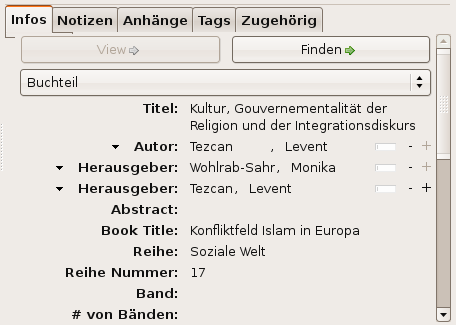

# Literaturverwaltung {#sec:literaturverwaltung}

Die Verwaltung von Literatur und das Zitieren von Texten stellt einen großen Teil des Aufwands beim Schreiben einer wissenschaftlichen Arbeit dar. Das zeigt allein schon die Länge des entsprechenden Kapitels in dieser Einführung. Jedoch gibt es auch hier Programme, die diese Arbeit deutlich erleichtern. Eine Literaturverwaltungssoftware bietet insbesondere die Möglichkeit,

-   die eigenen Literaturbestände unter Kontrolle zu behalten (z.B. Kopien aus früheren Seminaren durch eine Suche nach Titel, Autor oder Schlagworten auch später noch wiederzufinden),

-   die Formatierung eines Literaturverzeichnisses nach bestimmten Vorgaben vornehmen zu lassen, sowie

-   Literaturverweise in einem Text automatisch formatieren zu lassen und ein Verzeichnis der verwendeten Literatur erstellen zu lassen.

Es gibt eine Reihe kostenloser und kostenpflichtiger Programme für diese Aufgaben. Die meisten Anbieter kommerzieller Programme stellen für Studenten kostenlose Versionen (oft mit reduzierten Funktionsumfang) zur Verfügung. Die Ruhr-Universität besitzt eine Campus-Lizenz für das Programm »Citavi«, so dass Studierende auch die Vollversion kostenlos verwenden können.

Eines der gängigsten Literaturverwaltungsprogramme ist Endnote. Das Programm ist kostenpflichtig und hat in der Vergangenheit durch Probleme der Abwärtskompatibilität »geglänzt« (alte Datenbanken konnten von neuen Programmversionen nicht ohne Aufwand bearbeitet werden).

Mit Zotero (<http://www.zotero.org>) steht eine völlig freie Literaturverwaltung zur Verfügung. Diese lässt sich also auch nach Beendigung des Studiums kostenfrei weiterverwenden und läuft, im Gegensatz zu Citavi, auch unter MacOSX und Linux.

Eine Literaturverwaltung bietet oftmals sehr viele Möglichkeiten. Natürlich müssen diese nicht alle genutzt werden. Im Folgenden werden die Arbeitsschritte aufgeführt, die gängiger Weise mit einer Literaturverwaltung durchgeführt werden.

**Citavi**

Citavi ist ein Literaturverwaltungsprogramm, das als Programm auf dem eigenen PC installiert wird. Citavi ist dabei grundsätzlich kostenpflichtig; kostenfrei ist dabei zum einen die Version »Citavi Free«, bei der allerdings nur 100 Titel eingepflegt werden können, zum anderen stellt die RUB für alle Mitarbeiter und Studierenden eine kostenfreie Vollversion zu Verfügung, die unter <http://www.ruhr-uni-bochum.de/software/beschaffung/campus.html> erhältlich ist. Citavi kann folglich kostenfrei in vollem Umfang nur genutzt werden kann, solange man Studierender der RUB ist. Die dort eingepflegten Datensätze können aber exportiert und mit mittlerem Aufwand in andere Literaturverwaltungen migriert werden. Citavi besticht durch seine intuitive Nutzbarkeit und seine breiten Funktionen (Ideen- und Exzerptverwaltung, To-Do-Listen u.a.). Voreingestellte Zitationsstile sind vorhanden, diese können vergleichsweise einfach modifiziert oder ergänzt werden. Bei Problemen steht der Support der Herstellerfirma zur Verfügung.

Citavi kann momentan nur unter Windows genutzt werden. Eine Version für Mac sowie eine serverbasierte Version, die auch unter Linux uneingeschränkt genutzt werden kann, sind in Arbeit bzw. in Planung, aber bisher nicht erschienen.

Nähere Informationen siehe <http://www.citavi.com/>.

**Zotero**

Zotero ist ein Literaturverwaltungsprogramm, das in Kooperation von Universitäten und anderen öffentlichen Einrichtungen entwickelt wird und als OpenSource-Software kostenlos verfügbar ist. Zotero läuft dabei direkt im Webbrowser Firefox und ermöglicht es so, Literaturangaben aus einer Reihe von Bibliothekskatalogen, Datenbanken und anderen Internetseiten zu importieren. Für Microsoft Word und OpenOffice.org Writer stehen Plugins zur Verfügung, die das direkte Zitieren im Text und das Erzeugen von automatischen Literaturverzeichnissen sehr einfach machen. Zotero verfügt über eine große Anzahl an Zitationsstilen, das Erstellen eigener Stile erfordert jedoch tiefergehende Kenntnisse.

Zotero kann unter <http://www.zotero.org/> heruntergeladen werden.

## Erfassen von Literatur

Der erste Schritt ist das Erfassen von Literatur in der Literaturdatenbank. Dazu werden die Informationen eines Buchs, eines Zeitschriftenaufsatzes, oder einer anderen Textquelle in allgemeiner Form eingegeben. Die spätere Formatierung spielt hier noch keine Rolle. Bei einer Erfassung des Autors als »Weber, Max« kann später nach Belieben der Autor als »Weber, Max«, »Max Weber« oder sogar »Weber, M.« ausgegeben werden. Die Trennung von Bedeutung und Formatierung ist vergleichbar mit den Formatvorlagen einer Textverarbeitung, nur sind die Möglichkeiten hier wesentlich größer.

Es bietet sich an, die erfasste Literatur gleich mit der zugehörigen Kopie oder einer zugehörigen Datei zu verknüpfen. So lässt sich auch später noch ein Aufsatz leicht wiederfinden, den man vor längerer Zeit gelesen hatte. Im Prinzip stellt dies den Aufbau einer privaten kleinen Bibliothek dar. Jede Kopie muss mit einer kurzen Signatur versehen werden (z.B. aus Autor und Erscheinungsjahr gebildet), die der Signatur in der Literaturverwaltung entspricht. Wenn dann die Kopien nach Signatur geordnet abgeheftet werden, lässt sich leicht der passende Text zu einem Eintrag in der Literaturdatenbank finden. Bei elektronischen Dokumenten ist dies meist noch einfacher, hier kann oft per Knopfdruck aus der Literaturverwaltung heraus die zugehörige Datei geöffnet werden.

Einige Programme bieten in Verbindung mit einigen Internet-Katalogen die Möglichkeit an, die Literaturdaten direkt zu importieren. Dies erspart einiges an Tipparbeit, wenn beispielsweise ein Eintrag aus einem Bibliothekskatalog direkt in die Literaturverwaltung übernommen werden kann.

## Ausgeben von Literatur

Ein bedeutendes Stück Arbeit wird einem abgenommen, wenn man die Formatierung von Literaturlisten der Literaturverwaltung überlässt. Dies hat mehrere Vorteile:

-   Es ist deutlich schneller,

-   die gleiche Literaturliste kann leicht in einem völlig anderen Format ausgegeben werden,

-   man vermeidet Flüchtigkeitsfehler und Inkonsistenzen.

Hierzu stellen die Programme meist eine Auswahl fertiger Formatierungsregeln bereit, auf Wunsch können eigene erstellt werden.

Verwendet man ein solches Programm, so reicht es in der Regel, einen Stil auszuwählen, der den Vorgaben des Lehrstuhls (\[sec:zitieren\]) nahe kommt. Es muss nicht eigens ein Stil erstellt werden, der die Vorgaben exakt umsetzt. Für Zotero sind etwa die Stile »tah Sozialwissenschaften« (Autor-Jahr-Stil) und »tah Geistes- u. Kulturwissenschaften« (Fußnoten-Stil) geeignet.

## Einbinden in Textverarbeitung

Die meisten Literaturverwaltungsprogramme bieten außerdem noch die Möglichkeit, Literaturverweise direkt in ein Textdokument einzubinden. Auf diese Art kann nicht nur die Formatierung des Literaturverzeichnisses, sondern auch die Formatierung der Literaturverweise im Text kontrolliert werden. Außerdem kann automatisch ein Verzeichnis der im Text verwendeten Literatur erstellt werden.

In der Regel werden Microsoft Word und oft auch OpenOffice.org von den kommerziellen Literaturverwaltungsprogrammen unterstützt. LaTeX verfügt mit BibTeX über ein eigenes Literaturverwaltungssystem, das eng in LaTeX integriert ist. Mit dem neueren bibLaTeX werden auch die komplizierteren geisteswissenschaftlichen Konventionen (siehe Abschnitt »«, S. ) problemlos unterstützt.
